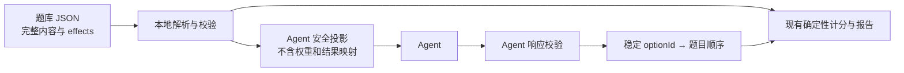

# NBTI 题库与 Agent 作答 JSON 标准设计

## 目标

把当前 12 道情境题变成可版本化、可校验、可被不同运行环境消费的 JSON 题库，并为未来 Agent 作答建立稳定的请求与响应协议。

本轮只建立本地数据契约、转换函数和校验测试，不连接任何模型服务，不改变用户作答、计分、报告或分享流程，也不上传答案。

## 方案比较

### 方案 A：一个 JSON 同时给站内计分和 Agent

实现最简单，但 Agent 会看到维度权重、结果身份和报告动作。它可能不再基于情境判断，而是为了某个结果反向选择答案。

### 方案 B：完整题库 + Agent 安全投影（采用）

完整题库是唯一内容源，包含题目、选项、解释动作和计分 effects。Agent 请求由程序从完整题库生成，只包含题目 ID、情境、题干和选项 ID/文案。Agent 响应只返回稳定 option ID；可选理由与置信度不参与计分。

### 方案 C：不建立题库标准，调用时临时拼 Prompt

初期代码最少，但题目、版本、回答顺序和错误处理会散落在 Prompt 与业务代码中，不适合后续更换 Agent 或批量执行。

## 数据分层

### 1. 题库文档

题库使用 JSON Schema Draft 2020-12，固定包含：

- `schemaVersion`：题库 Schema 的 SemVer 版本；
- `id` 与 `version`：测试系列及内容版本；
- `contentDigest`：题库规范化内容的 SHA-256 摘要；
- `locale`、标题与非诊断边界；
- 维度定义；
- 有稳定 ID 的题目与选项；
- 选项的内部解释动作与完整四维 `weights`；
- 当前结果类型列表。

四个维度的权重必须全部显式出现，值只能是 `-2、-1、0、1、2`。当前 NBTI v1 内容档案进一步要求每个选项恰好只有一个非零权重，且该值只能是 `-2` 或 `2`；这样 JSON 与现有 `SeriesDefinition` 一一对应，不引入第二套隐式计分语义。

### 2. Agent 请求

请求支持 `single` 与 `full-batch` 两种模式。每道题只包含：

- `id`、`tag`、`prompt`；
- `options[].id` 与 `options[].label`。

请求不包含 `weights`、`action`、维度名称、结果身份或弱信号阈值。v1 也不提供姓名、用户画像、历史回答或自由上下文字段；它只允许 Agent 以自身判断回答当前情境。约束显式要求不得做诊断、人格评估或能力评级；启用理由时也只能解释当前情境中的选择。未来若增加用户上下文，必须升级协议并单独取得外部处理同意，不能沿用当前“答案不上云”的文案。

### 3. Agent 响应

响应通过 `requestId`、`seriesRef.id`、`seriesRef.version` 和 `contentDigest` 与请求绑定。每条答案包含 `questionId` 与 `optionId`，可选 `selectionConfidence` 和简短 `rationale`。后两者只用于调试或展示，绝不进入计分。

响应只有 `ok` 与 `error` 两种状态。`ok` 必须恰好覆盖请求中的全部问题；拒答、部分作答、版本错误或输出错误都进入稳定错误结构，不得用默认选项补齐。只有通过完整校验的 `ok` 响应才能转换成现有计分数组。

## 版本规则

- 修改题干、选项、选项顺序、effects 或题目顺序：提升 `series.version`。
- 只修正文档说明、不改变可执行数据：不提升系列版本。
- 修改字段或语义：提升 `schemaVersion` / `protocolVersion`；破坏兼容性时提升主版本。
- ID 发布后保持稳定；删除后不得在同一系列中复用。
- 相同 `id + version` 必须具有相同 `contentDigest`，否则直接拒绝。
- 结果分享链接继续绑定系列版本，旧 Agent 响应不得静默套用到新题库。

## 失败模式

以下情况必须拒绝，不进行猜测或降级计分：

- 契约版本、系列 ID 或系列版本不匹配；
- question ID 重复、缺失或不属于请求；
- option ID 不属于对应题目；
- `ok` 响应缺题或多题；
- confidence 超出 `0…1`；
- 响应携带未声明字段。

网络超时、模型拒答和内容安全拒绝属于未来接入层问题，不由题库解析器伪装成某个选项。

## 非功能要求

- 确定性：同一套合法 option ID 与现有本地作答产生相同结果。
- 隐私：本轮零网络；未来发送用户上下文前必须明确同意。
- 可维护性：JSON 是题目内容唯一来源，TypeScript 只负责严格校验、投影与业务逻辑。
- 可移植性：Schema 与示例不依赖具体模型厂商。
- 可观测性：request ID、系列版本、内容摘要和可选 Agent 标识可用于排错，不进入结果解释。
- 性能：12 题文档在本地同步解析，无需引入运行时 Schema 库。
- 发布完整性：Ajv 在契约测试中编译全部 Schema，构建前必须通过 Schema、示例与题库摘要校验；动态题库还需在解析前异步校验摘要。

## 验收

- 当前 12 题能从 JSON 还原为原有 `SeriesDefinition`。
- 原有计分与 UI 测试全部通过。
- Agent 请求中找不到权重、动作或结果身份。
- 合法完整响应可稳定转换为 12 个答案索引。
- 重复题、错误选项、版本不匹配和不完整完成状态均被拒绝。
- 三份 JSON Schema 本身可被标准 JSON 解析。
